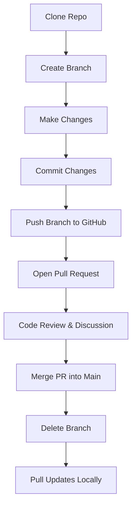

# 📌 Collaboration with Git & GitHub – Detailed Summary

## 🌍 Why Collaboration Matters
- You’re no longer coding alone — teamwork across cities and time zones is the norm.
- **Git** is more than a tool:
  - 🗂️ **Project history book**
  - 🗣️ **Communication partner**
  - ⚖️ **Conflict negotiator**

---

## 🤝 Collaboration in Real Projects
### 1. Remote Work
- Git allows smooth collaboration without meeting in person.

### 2. Distributed Teams
- Handles **time zones, laptops, internet issues** — all contributions sync asynchronously.

### 3. Conflict Management
- Developers may overwrite each other’s work.
- Git detects conflicts, alerts, and lets you resolve them.

---

## 🔗 Git + GitHub Workflow
### Connecting Local Project to GitHub
```bash
git remote -v    # shows linked GitHub repository
git remote add origin https://github.com/[username]/[repo].git
git push origin main   # upload code to GitHub
git pull origin main   # update local repo with teammates’ work
```

## ⚠️ Git Conflicts

- **When it happens**: Two people change the same line in a file.
- Conflict markers example:
  ```text
  <<<<<<< HEAD
  Hi, I’m Raman. Check out my work!
  =======
  Hello, I’m Raman Data Engineer
  >>>>>>> update-heading
  ```
- How to fix:
  - Choose one version or merge both.
  - Remove conflict markers.
    ```bash
    git add index.html
    git commit
    ```
- Best Practices:
  - Don’t panic — conflicts are normal.
  - Use IDE tools like VS Code.
  - Communicate with teammates.

## 🔄 Pull Requests (PRs)
- The real collaboration space on GitHub:
  - Review code
  - Suggest improvements
  - Approve or reject
  
Writing a Good PR Description
❌ Bad: “_Added stuff_”
✅ Better: “_Added responsive dark mode for homepage. Tested on mobile and desktop. Fixes #12._”

## 💻 GitHub Command-Line Tool (`gh`)
GitHub provides a CLI tool (`gh`) for managing resources via commands.

### Core Commands
- `gh auth` → Authenticate GitHub & Git
- gh browse → Open repos/issues/PRs in browser
- gh codespace → Manage Codespaces
- gh gist → Manage gists
- gh issue → Manage issues
- gh pr → Manage pull requests
- gh project → Manage GitHub projects
- gh release → Manage releases
- gh repo → Manage repositories
✅ Helps automate and speed up GitHub workflows.

## 🏁 Wrap-Up

- Git & GitHub = Not just about **code**, but about **people + collaboration**.
- Learning Git teamwork = Becoming a **better teammate**, not just a coder.

## 🧪 Try This (Hands-On Practice)
1. Clone a repo.
2. Create a branch & make a small change.
3. Commit & push the branch.
4. Open a PR with a clear description.
5. Review (yourself or a friend).
6. Merge PR & delete the branch.

## 🔄 Git & GitHub Collaboration Workflow



### ✅ This workflow visually explains how developers collaborate:

1. Clone the repo
2. Create a branch
3. Make changes & commit
4. Push changes
5. Open a PR
6. Review → Merge → Delete branch
7. Pull updates locally
