# 📊 Why Tabular Data and Relational Databases Matter

## 🔹 Why Tabular Data Matters
- **Definition**:  
  Tabular data is information organized into **rows and columns** (like spreadsheets).
  
- **Examples**:  
  - Class student list  
  - Monthly expenses in Excel  
  - Contact lists  

- **Importance**:  
  - Makes data **organized, neat, and readable**  
  - Simplifies **searching, updating, and managing** information  
  - Real-life data (sales, employee records, transactions) naturally fits into tables  

### 📝 Exercise:
- Open any spreadsheet.  
- Observe: What is stored in **rows** and **columns**?  
- Think: How would this data grow as the business scales?  

---

## 🔹 Why We Use Relational Databases
- **Problem with one big table**:  
  - Lots of **repeated information**  
  - Updates (like changing a phone number) become **tedious and error-prone**  

- **Solution → Relational Databases**:  
  - Break data into **separate tables**  
  - Link them with a **common value (key)** like `customer_id`  
  - Example:  
    - Table 1 → Customer details  
    - Table 2 → Customer transactions  
    - Link: `customer_id`  

- **Advantages**:  
  - Clean and simple structure  
  - Easy maintenance and updates  
  - Avoids duplication  

### 📝 Exercise:
- Research how **SQLite** connects two tables using a common column (`customer_id`).  
- Focus on understanding the **relation**, not writing code.  

---

## 🔹 Relational Database Systems
Different systems manage tabular data using the relational model:

1. **SQLite**  
   - Lightweight, requires no server  
   - Best for learning and small apps  
   - Just a file on your computer  
   - Used in browsers, phones, and OS  

2. **MySQL**  
   - Widely used for websites and apps  
   - Requires setup  
   - Offers scalability and more features  

3. **PostgreSQL**  
   - Reliable, advanced, feature-rich  
   - Great for complex applications  

4. **SQL Server (Microsoft)**  
   - Used in large enterprise environments  

- **Beginner Tip**: Start with **SQLite** → simple but powerful enough for real-world apps.  
- Think of it as **training wheels** for databases.

---
## 📊 Tabular Data → Relational Databases → Systems

```mermaid
flowchart LR

A[📋 Tabular Data] --> B[🔹 Organized in Rows & Columns]
A --> C[✅ Easy to Search, Update & Manage]
A --> D[💼 Examples: Sales, Expenses, Records]

D --> E[⚠️ Problem: One Big Table]
E --> F[❌ Data Duplication & Update Issues]

F --> G[✅ Relational Databases]
G --> H[🗂 Split Data into Multiple Tables]
G --> I[🔗 Linked by Common Key e.g. customer_id]

I --> J[📊 Example]
J --> J1[(Customer Table)]
J --> J2[(Transactions Table)]
J1 <-- customer_id --> J2

G --> K[⚙️ Relational Database Systems]

K --> L[🟢 SQLite - Simple, File-based, Best for Beginners]
K --> M[🔵 MySQL - Popular for Web Apps]
K --> N[🟣 PostgreSQL - Advanced Features]
K --> O[🟠 SQL Server - Enterprise Use]
```

---

### 📝 Exercise:
- Create a small SQLite table.  
- Check:  
  - What is the **file size** of the database?  
  - Where is the file saved?  

---
