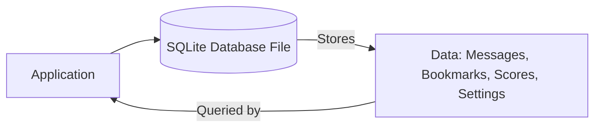

# SQLite in Everyday Life

SQLite is one of the most widely used database engines in the world—often working silently behind the scenes in apps, devices, and software you use daily.  

---

## 🔹 What is SQLite?
- A **lightweight, fast, embedded database engine**.
- Works **inside your app**, unlike big databases that run on separate servers.
- Think of it like a **tiny notebook**:
  - **Write notes** → store data
  - **Flip pages** → query data
  - **Portable** → works offline, no internet required
- Just open the file and use it—**no external connection needed**.

👉 [About SQLite](https://www.sqlite.org/about.html)

---

## 🔹 Where is SQLite Used?
You probably interact with SQLite every day without knowing it:
- **Mobile apps** → chat apps store messages locally
- **Web browsers** → bookmarks, history, settings
- **Games** → high scores, saved settings
- **Smart devices** → IoT gadgets, even smart fridges
- **Global reach** → installed **1+ trillion times**

👉 [Most Deployed Database Engine](https://www.sqlite.org/mostdeployed.html)

---

## 🔹 Why Developers Love SQLite
- **Small size** → ~600 KB (smaller than a selfie!)
- **Fast performance** → quick reads/writes
- **Reliable** → proven stability
- **No setup needed** → no servers, no configs, just include and use
- **Versatile** → used in:
  - Mobile apps
  - Desktop software
  - Embedded systems
  - IoT, robots, spacecraft

👉 [What Makes SQLite Different](https://www.sqlite.org/different.html)

---

## 🔹 Why Should You Care?
- If you plan to **build apps** (notes app, game, IoT project, etc.), SQLite is often the **easiest choice for storing data**.
- Learning SQLite gives you **hands-on experience with real-world tools** used in the industry.
- Helps you understand **how software works behind the scenes**.

---

## 🔹 SQLite Workflow (Simple Diagram)

---
## 🌱 Reflect & Explore
Before moving on, think about:
1. What surprised you most about where SQLite is used?
2. Can you imagine a project where SQLite would be handy?
3. Why does SQLite **not need a separate server**?

👉 Helpful Links:  
- [SQLite Homepage](https://www.sqlite.org/index.html)  
- [About SQLite](https://www.sqlite.org/about.html)  
- [Most Deployed Database Engine](https://www.sqlite.org/mostdeployed.html)  
- [What Makes SQLite Different](https://www.sqlite.org/different.html)  
