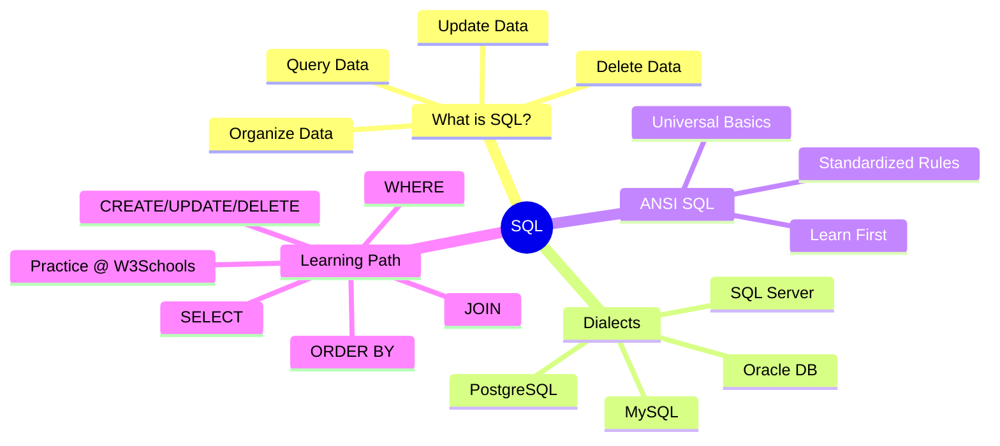

# Learn SQL – Beginner’s Guide

SQL powers most of the world’s data interactions. From pulling your order history in apps to showing your name on websites when you log in—SQL works behind the scenes.

---

## 📌 What is SQL?
**SQL (Structured Query Language)** is a language used to communicate with databases.  

It allows you to:
- **Query (Ask Questions)** → e.g., *"Get all users who signed up this week"*
- **Update Data** → e.g., *"Change this customer’s email"*
- **Delete Data** → e.g., *"Remove all entries with missing values"*
- **Organize Data** → e.g., *"Sort products by highest price"*

👉 In short: **SQL helps you interact with databases efficiently.**

---

## 📌 SQL Dialects (Different Flavors)
Just like English has regional differences, SQL also has variations depending on the database:

- **Microsoft → SQL Server**
- **Oracle → Oracle DB**
- **PostgreSQL → PostgreSQL**
- **MySQL → MySQL**

Each system may add **extra features** or use **different syntax** (like *color vs colour*).  
➡️ But don’t worry—the **core concepts stay the same**.

---

## 📌 ANSI SQL (The Standard SQL)
- **ANSI SQL** = The standardized version of SQL (like a grammar book).  
- Most databases understand it, even if they have their own "accent."  
- As a beginner:
  - **Learn ANSI SQL first** → builds a strong foundation.
  - Later explore **system-specific features** when needed.

💡 *Think of ANSI SQL as learning to drive—once you know the basics, switching cars is easy.*

---

## 📌 How to Start Learning SQL
A recommended resource: **[W3Schools SQL Tutorial](https://www.w3schools.com/sql/)**  

It provides small, interactive lessons covering:
1. **SELECT** → Retrieve data from tables.
2. **WHERE** → Filter data.
3. **ORDER BY** → Sort data.
4. **JOIN** → Combine multiple tables.
5. **CREATE / UPDATE / DELETE** → Manage and modify tables.
6. And more features for **real-world applications**.

---

## ✅ Key Takeaways
- SQL = Language to talk to databases.
- Variants exist (MySQL, PostgreSQL, Oracle, SQL Server).
- Learn **ANSI SQL first** for strong fundamentals.
- Practice interactively with **W3Schools** or similar platforms.

---

## 🧠 SQL Mind Map

