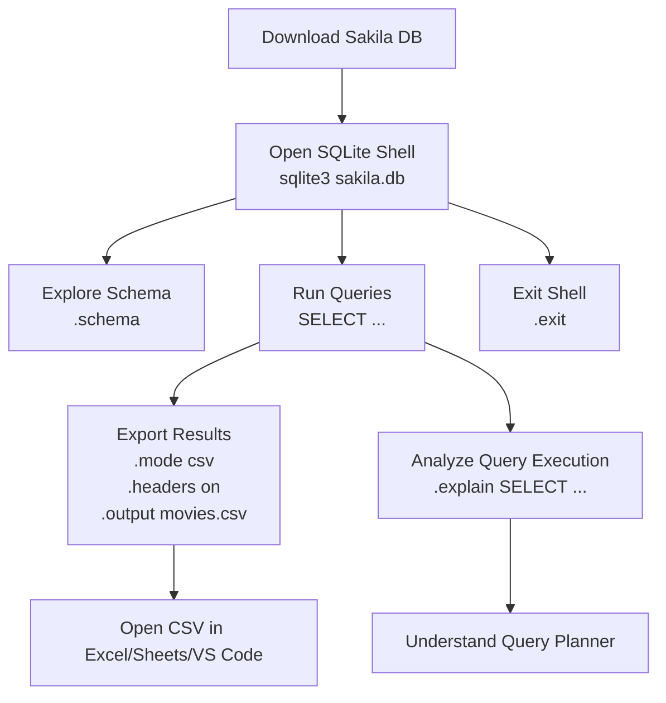

# SQLite Getting Started – Detailed Summary

## 1. Introduction
SQLite is a lightweight database engine that lets you **practice SQL hands-on**.  
This guide uses the **Sakila database**, a sample dataset simulating a movie rental store.

---

## 2. Meet Sakila
- **What it is:** A sample database with tables for films, actors, customers, rentals, payments, etc.
- **Purpose:** Small, realistic, and ideal for learning how relational databases work.

---

## 3. Downloading the Sakila Database
- Get the prebuilt `sakila.db` file (available on [GitHub](https://github.com/ivanceras/sakila/blob/master/sqlite-sakila-db/sakila.db)).
- Steps to download:
  1. Right-click `Raw` → `Save Link As` → save as **sakila.db**.
  2. Open terminal in the same directory.
  3. Start SQLite shell:
     ```bash
     sqlite3 sakila.db
     ```
- You’re now inside SQLite and ready to query.

---

## 4. Exploring the Database

### 🔹 View the Schema
```sql
.schema
```
- Shows table creation structure (blueprint of the database).

### 🔹 Export Data to CSV
Steps to export results to CSV:
```sql
.mode csv
.headers on
.output movies.csv
SELECT * FROM film;  -- Replace with your query
.output stdout
```
- `.mode csv` → output format is CSV
- `.headers on` → include column names
- `.output` → specify output file (e.g., `movies.csv`)
This lets you open results in **Excel, Google Sheets, or VS Code**.

### 🔹 Query Execution Plan
```sql
.explain SELECT * FROM film WHERE rating = 'PG';
```
- Shows how SQLite’s **query planner** runs your SQL.
- Useful for optimization (though it may look complex).
---

## 5. Closing SQLite
When done:
```sql
.exit
```
- Exits the SQLite shell safely.
---

## 6. Summary of Commands Learned
- Open database: `sqlite3 sakila.db`
- View schema: `.schema`
- Export data: `.mode`, `.headers`, `.output`
- Explain queries: `.explain`
- Exit shell: `.exit`
---

## SQLite Workflow with Sakila Database



👉 This diagram shows the full flow:
- Start by **downloading** the Sakila database  
- Open it in **SQLite shell**  
- Then you can:  
  - Explore schema  
  - Run queries  
  - Export to CSV  
  - Analyze queries with `.explain`  
- Finally, **exit** safely  

Do you want me to also make a **cheat sheet table of commands** (with descriptions) in Markdown so you can use it as a quick reference?
---

## 7. Extra Practice Queries
Try more queries for hands-on learning:
```sql
-- Get movies longer than 120 minutes
SELECT title, release_year FROM film WHERE length > 120;

-- Count total customers
SELECT COUNT(*) FROM customer;

-- List first 10 actors
SELECT first_name, last_name FROM actor LIMIT 10;
```
---

## 8. Key Takeaways
- You worked with a real database (`sakila.db`).
- Learned to **explore schemas** and **export results**.
- Understood how to analyze query execution with `.explain`.
- Built **muscle memory** with SQL commands.
