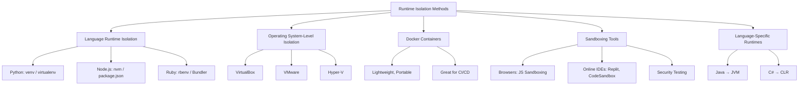

# 🛠 Ways to Isolate Your Runtime

When running code across different environments, inconsistencies can cause errors. To solve this, developers use **runtime isolation** techniques to create “safe bubbles” for code execution. These ensure consistent behavior regardless of the system.

---

## 1. Language Runtime Isolation
- **Problem**: Conflicting dependencies between projects.
  - Example: Project A needs `requests==2.25` while Project B needs `requests==2.31`.
- **Solution**: Virtual environments provide each project its own dependencies and runtime.

### Tools:
- **Python**: `venv`, `virtualenv`
- **Node.js**: `nvm`, `package.json`
- **Ruby**: `rbenv`, `Bundler`

---

## 2. Operating System-Level Isolation
- Uses **Virtual Machines (VMs)** — complete computers running inside another system.
- **Pros**: Strong isolation, full OS support.
- **Cons**: Heavy, slow compared to containers.

### Examples:
- VirtualBox
- VMware
- Hyper-V

---

## 3. Docker Containers
- Lightweight and faster alternative to VMs.
- Packages **code, dependencies, and environment** in portable containers.
- Provides "just enough OS" for running applications consistently.

### Why Developers Love Docker:
- ✅ Reproducible environments  
- ✅ Works across laptops, servers, and cloud  
- ✅ Ideal for **CI/CD pipelines**

🔗 [Learn more about Docker](https://www.docker.com/why-docker)

---

## 4. Sandboxing Tools
- Runs code in **restricted, controlled environments** (like a padded room).
- Prevents code from affecting the host system.

### Common Uses:
- Browsers → JavaScript sandboxing
- Online coding platforms → Replit, CodeSandbox
- Security testing tools

---

## 5. Language-Specific Runtimes
Some languages provide built-in isolation via their own runtime engines.

- **Java** → Java Virtual Machine (JVM)  
- **C#/.NET** → Common Language Runtime (CLR)  

### Benefits:
- Cross-platform compatibility (Windows/Linux/Mac)
- Less worry about OS-level differences

---

## 6. Choosing the Right Tool
- 🐍 Python-only projects → Use **virtual environments**  
- 🚀 Team projects / Production deployment → Use **Docker**  
- 💻 Running a full OS inside another → Use **Virtual Machines**  
- 🔒 Need strict code restrictions → Use **Sandboxing**  
- ☕ Java / C# development → Leverage **JVM/CLR**  

---

## 📊 Visual Comparison (Mermaid Diagram)

## 📚 Keep Learning
- [Python venv explained](https://docs.python.org/3/library/venv.html)
- [Docker for Beginners Guide](https://docs.docker.com/get-started/)
- [Virtual Machines vs Containers](https://www.redhat.com/en/topics/containers/containers-vs-virtual-machines)
- [What is the JVM?](https://www.oracle.com/java/technologies/javase/jvm.html)
