# 🚀 Getting Started with Docker

## 1. Installing Docker
- Download and install **Docker Desktop** from the official site.  
- Supports **Windows, macOS, Linux**.  
- Once installed, open your **terminal**.

---

## 2. Pulling & Running Your First Container
```bash
docker run hello-world
```

#### What Happens:
1. Docker checks for the `hello-world` image locally.
2. If missing, it downloads it from **Docker Hub**.
3. Creates a container from that image.
4. Prints a success message. ✅
👉 Congratulations — your first container is running!

---

## 3. Docker Workflow (Steps to Dockerize an App)
1. Write a Dockerfile → Recipe for packaging your app.
2. Build an Image
```bash
docker build -t my-app .
```
3. List Images
```bash
docker images
```
Shows all available images on your system.

---

## 4. Writing a Dockerfile (Example for a Python Flask App)
```Dockerfile
# base image
FROM python:3.11

# work directory
WORKDIR /app

# copy
COPY . .

# run
RUN pip install -r requirements.txt

# port
EXPOSE 5000

#command
CMD ["python", "app.py"]
```
#### Breakdown:
- `FROM python:3.11` → Use Python 3.11 as the base image.
- `WORKDIR /app` → Set working directory inside container.
- `COPY . .` → Copy project files from local machine to container.
- `RUN pip install -r requirements.txt` → Install dependencies during image build.
- `EXPOSE 5000` → Inform Docker that the app uses port `5000`.
- `CMD ["python", "app.py"]` → Run this command when container starts.
  
---

## 5. Building & Running Your App
```bash
# Build the image
docker build -t my-python-app .

# Run the container and map port 5000
docker run -p 5000:5000 my-python-app
```
👉 Now your Flask app should be running inside Docker.

---
## 6. Key Docker Concepts You Learned
- How to `pull` and `run` containers.
- The `Docker workflow`: Dockerfile → Image → Container.
- Writing and understanding a `Dockerfile`.
---

## 7. Useful Docker Commands
- List Images
  ```bash
  docker images
  ```
- Check Running Containers
  ```bash
  docker ps
  ```
- View Logs
  ```bash
  docker logs <container_id>
  ```
- Access Inside a Container
  ```bash
  docker exec -it <container_id> /bin/bash
  ```
- Stop a Container
  ```bash
  docker stop <container_id>
  ```
- Remove an Image
  ```bash
  docker rmi <image_id>
  ```
---
## 8. Practice Exercises
1. Run the `hello-world` container to confirm Docker works.
2. Write your own `Dockerfile` for a simple Python app.
3. Build & tag your image as `my-first-app`.
4. Run your app with port mapping (`-p`).
5. List and inspect your `local images`.
6. Stop and remove containers/images to clean up.
---

# 🐳 Docker Workflow Diagram

```mermaid
flowchart LR
    A[Dockerfile 📄] --> B[Build Image 🛠️]
    B -->|docker build| C[Docker Image 📦]
    C -->|docker run| D[Container 🚀]
    D --> E[Running Application 🌐]
```



This diagram shows the flow:  
- **Dockerfile** → describes how to package the app  
- **Build** → creates a reusable **image**  
- **Run** → starts a **container**  
- **Container** → hosts your **running app**  

---

## 📚 Useful Links

- [Install Docker](https://docs.docker.com/get-docker/)  
- [Docker Run Docs](https://docs.docker.com/engine/reference/run/)  
- [Dockerfile Reference](https://docs.docker.com/engine/reference/builder/)  
- [Docker Cheat Sheet](https://dockerlabs.collabnix.com/docker/cheatsheet/)  
