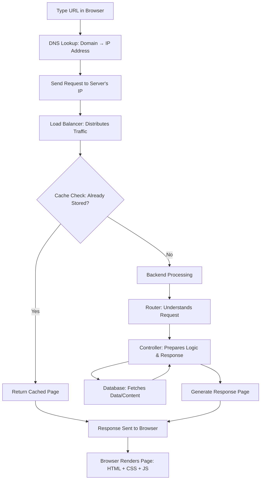

# What Happens When You Type a URL in the Browser?

When you type `www.pizzamagic.com` in the browser and press Enter, a complex journey begins that eventually delivers the website to your screen.  
This process involves multiple steps, similar to sending a letter and receiving a reply.

---

## 🔹 Step 1: DNS – Finding the Right Address
- **URL → IP Address Translation**
  - Browser doesn’t know where the website lives.
  - DNS (Domain Name System) acts like the **internet’s phonebook**.
  - Converts human-readable domain names (`www.pizzamagic.com`) → machine-readable IP (`192.168.1.27`).
- **Analogy:** Looking up a friend’s address in a directory.

📖 Learn more: [How DNS Works](https://www.cloudflare.com/learning/dns/what-is-dns/)

---

## 🔹 Step 2: Sending the Request to Server’s IP
- Browser now has the correct IP.
- It sends a **request** like: “Send me the homepage of pizzamagic.com”.
- **Analogy:** Like ordering pizza over the phone.

---

## 🔹 Step 3: Load Balancer – The Traffic Manager
- Large websites use **multiple servers**.
- **Load balancer** decides which server should handle your request.
- Ensures no server gets overloaded.  
- **Analogy:** A club bouncer or traffic cop directing people.

---

## 🔹 Step 4: Cache Check – Is It Already Made?
- Before creating new content, server checks **cache**:
  - If a stored copy exists → sends it immediately (faster).
  - If not → prepares fresh data.
- **Analogy:** Leftover pizza in the fridge.

📖 Learn more: [What is Caching?](https://developer.mozilla.org/en-US/docs/Web/HTTP/Caching)

---

## 🔹 Step 5: Inner Kitchen – Router, Controller & Database
This is where **backend logic** works:

1. **Router**  
   - Decides what you’re asking for: homepage, menu, signup, etc.
   
2. **Controller**  
   - Acts like the **chef**, preparing the response.  
   - Example: If user asks for "Veggie Delight menu", controller fetches it.

3. **Database**  
   - Stores ingredients (pizza types, prices, user info).  
   - Controller queries database for necessary data.

- **Frameworks like Django/Rails** use this process (routes → controllers → models).

📖 Learn more: [Request-Response Cycle](https://guides.rubyonrails.org/action_controller_overview.html)

---

## 🔹 Step 6: Response Back to Browser
- Server sends the final **HTML/CSS/JS** back.
- Browser renders it into a **website** (images, buttons, menus).
- **Analogy:** Pizza finally delivered to your table!

---

## 🎯 Why This Matters
- **For Developers:**
  - Helps debug errors effectively.
  - Helps optimize and design faster websites.
- **For Learners:**
  - Builds appreciation of the layers behind the web.
  - Gives you knowledge to explain the process clearly.

Fun fact:  
Typing a URL triggers DNS, load balancers, routers, controllers, and databases **before a page appears!**

---

## 🌐 What Happens When You Type a URL?

This diagram clearly shows:  
1. **Request flow** from typing the URL → DNS → server.  
2. **Decision-making at cache check** (reuse or fetch new data).  
3. **Backend flow** (Router → Controller → Database).  
4. **Response back to browser** for rendering.  

👉 Do you also want me to add **short analogies** (like pizza/fridge/bouncer) as labels inside the diagram for easier recall?

---

## 📚 For Deeper Dives
- [How the Internet Works – Stanford](https://web.stanford.edu/class/msande91si/www-spr04/readings/week1/InternetWhitepaper.htm)  
- [How Web Servers Work – HowStuffWorks](https://computer.howstuffworks.com/web-server.htm)  

---

## ✅ Key Takeaway
Every time you hit **Enter** in a browser:
1. DNS finds the IP.
2. Request goes to the server.
3. Load balancer directs traffic.
4. Cache is checked.
5. Backend (router, controller, database) processes request.
6. Response is returned → Browser renders website.

You’ve just peeked behind the curtain—the **backstage of the web**!
