# 🌩️ The Business of Cloud Computing: Why It’s a Big Deal

Cloud computing powers apps, websites, and online services around the world. It’s not just for big tech companies — it’s shaping careers, startups, and global industries.

---

## 🚀 Why Cloud Is Booming
- **Market Growth**: Expected to cross **$1 trillion by 2030**.  
- **Adoption**: From Netflix and Spotify to startups, everyone relies on it.  

### 🔑 Key Benefits
- **Scalability**: Adjust resources easily — no waste.  
- **Flexibility**: Handle spikes like sales or heavy traffic.  
- **Speed of Innovation**: Launch products without huge upfront costs.  
- **Job Opportunities**: Cloud engineers, DevOps, architects in high demand.  

*Fun Fact*: Netflix streams **billions of hours monthly** using cloud servers.

---

## 🛠️ Types of Cloud Services (IaaS, PaaS, SaaS)

1. **IaaS (Infrastructure as a Service)**  
   - Rent servers, storage, networking.  
   - You manage OS + applications.  
   - **Examples**: AWS EC2, Google Compute Engine, Azure VMs.  
   - Analogy: *Renting an empty flat* — you bring furniture.  

2. **PaaS (Platform as a Service)**  
   - Pre-built environment for app development.  
   - No server management required.  
   - **Examples**: Heroku, Google App Engine, Azure App Services.  
   - Analogy: *Serviced apartment* — just move in and use.  

3. **SaaS (Software as a Service)**  
   - Fully ready software over the internet.  
   - No installs, quick access.  
   - **Examples**: Google Docs, Slack, Salesforce.  
   - Analogy: *Café Wi-Fi* — just open and use.

---

## 🏢 Major Cloud Providers
- **AWS**: Market leader, global reach, used by Netflix & Airbnb.  
- **Google Cloud**: Strong in AI/ML; used by Spotify.  
- **Azure**: Deeply integrated with Microsoft tools; enterprise favorite.  
- **DigitalOcean**: Simple, developer-friendly.  
- **Hetzner**: Affordable, strong EU presence.  
- **IBM Cloud**: Focused on enterprise + hybrid cloud.  
- **Dell**: On-prem cloud-like infra for data-sensitive companies.  
- **Hostinger**: Beginner-friendly, best for small websites.  

---

## ⚡ Special-Purpose Cloud Hosting
- **fly.io**: Runs apps closer to users → faster speed.  
- **Railway**: Easy app + database deployment (perfect for students).  
- **WordPress Hosting**: Optimized for blogs & content sites.

---

## 🇮🇳 Indian Cloud Providers
- **E2E Networks**: Low-cost hosting, GPU servers.  
- **Others**: Utho, Serverbasket, NxtGen, Sify, ESDS.  
- Benefits: Local compliance, better speed (data stays nearby), cost-effective.

---

## 🖥️ Hosting Options
| Hosting Type       | What It Means                   | Pros                       | Cons                      |
|--------------------|---------------------------------|----------------------------|---------------------------|
| **Basement Setup** | Host from own PC                | Cheap, full control        | Risky, unreliable         |
| **Co-location**    | Rent space in data center       | Great performance          | Expensive, DIY upkeep     |
| **Bare Metal**     | Rent physical machine           | High power                 | Less flexible             |
| **VPS**            | Shared but isolated servers     | Affordable, balanced       | Shared performance limits |

👉 Most modern apps use **Cloud VPS or Bare Metal**.

---

## 🛡️ Data Privacy & Cloud Laws
- **GDPR (EU)**: Protects EU users’ data.  
- **CCPA (California)**: Users control how data is used.  
- **DPDP Act (India)**: Ensures privacy + local compliance.  

🔑 Importance: Data protection builds **user trust**.

---

## ⚠️ Challenges of Cloud Computing
- **Cost Creep**: Pay-as-you-go can spiral if unmanaged.  
- **Vendor Lock-in**: Hard to switch once deeply integrated.  
- **Proprietary Tools**: Locked into one ecosystem.  
- **Complexity**: Serverless + microservices can be overwhelming.  

---

# ☁️ Cloud Service Models

```mermaid
flowchart TD
    A[Cloud Computing] --> B[IaaS: Infrastructure as a Service]
    A --> C[PaaS: Platform as a Service]
    A --> D[SaaS: Software as a Service]

    B --> B1[You rent servers, storage, networking]
    B --> B2[Examples: AWS EC2, Azure VMs, Google Compute Engine]
    B --> B3[Analogy: Empty flat - bring furniture]

    C --> C1[Pre-built dev environment]
    C --> C2[Examples: Heroku, Google App Engine, Azure App Services]
    C --> C3[Analogy: Serviced apartment - ready to use]

    D --> D1[Complete software delivered online]
    D --> D2[Examples: Google Docs, Slack, Salesforce]
    D --> D3[Analogy: Café Wi-Fi - just connect & use]
```

This will render a **hierarchical flowchart**:

- Top-level: **Cloud Computing**  
- Branches into **IaaS, PaaS, SaaS**  
- Each explains **what it is, examples, and analogy**  

Do you also want me to add another **Mermaid chart comparing Hosting Types** (Basement, VPS, Bare Metal, Cloud)? That could make the hosting section clearer too.

---

## 🎯 Final Thoughts
Cloud computing = **power + flexibility + career opportunities**, but it comes with costs and risks.  
It’s not just for tech giants — students, startups, and enterprises all benefit.  

**Takeaway**:  
👉 Learning cloud today could make you tomorrow’s **cloud architect**.  
