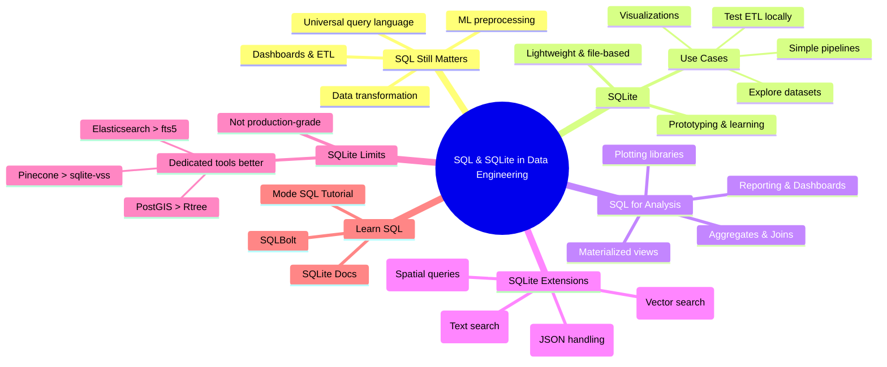

# Using SQL & SQLite in Data Engineering

## Why SQL Still Matters (Even in 2025)
SQL remains a **core skill** in data engineering:
- **Universal query language** for structured data.  
- **Transforms raw data** into usable formats.  
- Powers **analytics dashboards, ETL pipelines, and ML preprocessing**.  
- Almost every modern data workflow starts with SQL.  

✅ **Key Insight**: No matter how advanced AI or data tools get, SQL is still the **foundation**.

---

## Why SQLite?
While production systems often use **PostgreSQL, BigQuery, or Snowflake**, SQLite is:
- **Lightweight** – runs as a single file, no server needed.  
- Perfect for **learning, prototyping, and local testing**.  

### Use Cases
- Test ETL scripts locally.  
- Explore datasets (e.g., Kaggle `.db` files).  
- Load results into charts/visualizations.  
- Run simple transformation pipelines.  

✅ **Key Insight**: SQLite is a **low-friction sandbox** for data engineers.

---

## SQL for Analysis & Visualization
SQL is not just about querying—it’s for **data shaping**:
- **Reporting & dashboards** (Metabase, Superset, Looker).  
- Feeding **plotting libraries** (Matplotlib, Seaborn, Plotly).  
- Creating **materialized views** for downstream teams.  
- Preparing **aggregates, time-series, and joins**.  

🍽️ **Metaphor**: SQL = **the prep kitchen** before data is served.

---

## SQLite Extensions You Should Know
SQLite supports **extensions** that expand its power:

### 1. `json1`
- Work with JSON data inside tables.  
```sql
SELECT json_extract(data, '$.user.name') FROM logs;
```
Useful for semi-structured data (APIs, logs).
### 2. `fts5` (**Full Text Search**)
- Add fast text search across columns.
  ```sql
  SELECT * FROM documents WHERE content MATCH 'machine learning';
  ```
Great for product names, articles, comments.
### 3. `Rtree`
- Efficient for spatial or range queries (coordinates, bounding boxes).
- Common in geospatial workflows.
### 4. `sqlite-vss`
- Vector similarity search (for embeddings in AI/ML).
- Enables **semantic search** in local projects.
---

## Using SQL & SQLite in Data Engineering

### Why SQL Still Matters
- Universal query language
- Data transformation
- Dashboards, ETL, ML prep
- Foundation of data workflows

### Why SQLite
- Lightweight, file-based DB
- Easy for prototyping & learning
- Use cases:
  - Test ETL locally
  - Explore datasets
  - Simple pipelines
  - Visualizations

### SQL for Analysis & Visualization
- Reporting & dashboards
- Feeding plotting libraries
- Materialized views
- Aggregates & joins

### SQLite Extensions
- **json1** → JSON handling  
- **fts5** → Full-text search  
- **Rtree** → Spatial queries  
- **sqlite-vss** → Vector similarity search  

### Limits of SQLite
- Not production-grade
- Limited vs dedicated tools
  - PostGIS > Rtree
  - Elasticsearch > fts5
  - Pinecone > sqlite-vss

### Learn SQL
- Mode SQL Tutorial
- SQLBolt
- SQLite Docs

---

## 📌 Mindmap


---

## Heads-up: SQLite Has Limits
- **Not production-grade**for high-concurrency or multi-user environments.
- Extensions are useful but **less feature-rich** than dedicated tools:
  - PostGIS > Rtree (geospatial)
  - Elasticsearch > fts5 (text search)
  - Pinecone > sqlite-vss (vector search)
- ✅ Key Insight: **SQLite = local testing + learning**, not production-scale pipelines.
---

## 📚 Resources to Learn SQL (Refresher)

If you’re new to SQL, here are some beginner-friendly resources:

- [Mode SQL Tutorial](https://mode.com/sql-tutorial)  
- [SQLBolt](https://sqlbolt.com)  
- [SQLite Documentation](https://www.sqlite.org/docs.html)  
