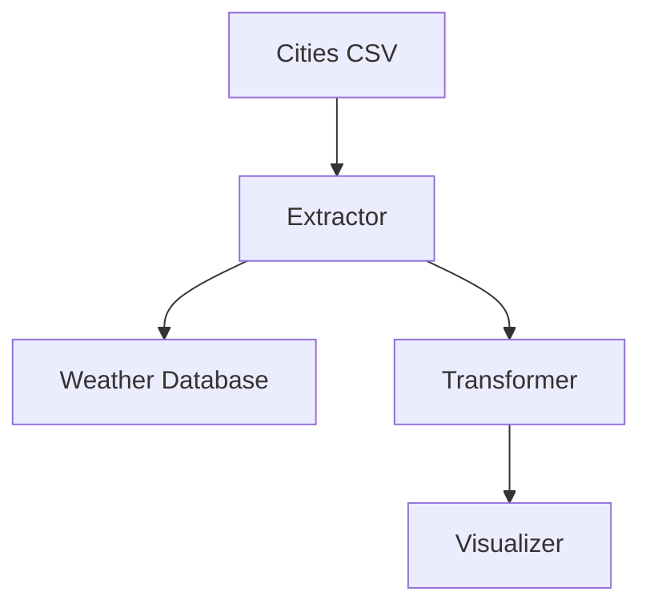

# 📊 From Data to Insight: Building Your First ETL Pipeline with Weather Data

This guide helps beginners understand how raw weather data is transformed into visual insights using ETL (Extract, Transform, Load) processes. You'll build a complete pipeline using Python, SQLite, and matplotlib, with explanations, diagrams, and exercises.

---

## ✅ **1. What is ETL?**

**ETL** stands for:

1. **Extract** → Pull data from sources like APIs, CSV files, or databases.
2. **Transform** → Clean, reshape, and summarize data.
3. **Load** → Store or visualize the transformed data.

### 📖 **Analogy: Making Chai**
- Extract → Water, milk, tea leaves
- Transform → Boiling and straining
- Load → Pour into a cup for drinking

---

## ✅ **2. What’s a Pipeline?**

A **pipeline** is a sequence of connected steps that data travels through.

### Data Flow Diagram

---

### 📖 **Analogy: Morning Routine**
- Wake up → Brush teeth → Grab coffee  
Just like this, data follows a structured flow to become usable.

---

## ✅ **3. Real-World Use Cases**

| Domain            | Example                         |
|-----------------|---------------------------------|
| Weather          | Hourly weather → Forecasts      |
| E-commerce       | Sales → Daily/Monthly reports   |
| Healthcare       | Patient stats → Health trends   |

**Insight:** ETL pipelines help organizations turn raw data into decisions.

---

## ✅ **4. Tech Stack: From Simple to Industrial**

| Stage        | Beginner Tools        | Industry Tools              |
|--------------|----------------------|----------------------------|
| Extract      | Python requests, CSV | Kafka, CDC                 |
| Transform    | pandas, SQLite, SQL | Apache Spark, dbt          |
| Load         | matplotlib, SQLite  | PostgreSQL, lakehouse     |
| Orchestration| Python scripts       | Airflow, Dagster, Prefect |

---

## ✅ **5. Why Start with Python, SQLite & Matplotlib?**

- **Python** → Easy to fetch and process data
- **SQLite** → Simple local database, no server setup
- **matplotlib** → Quick visualization with minimal code

Starting small ensures you learn the basics before handling large-scale systems.

---

## ✅ **6. Weather Data ETL Project**

### 🔢 **Step-by-Step Implementation**

### ➤ **Extract: Reading & Fetching Data**

#### Example Code – Reading Cities

```python
import pandas as pd

cities = pd.read_csv('indian_cities.csv')
print(cities.head())
```
#### Example Code – Fetching Weather Data
```python
import requests
import time

API_KEY = "your_api_key"
BASE_URL = "http://api.weatherapi.com/v1/current.json"

def fetch_weather(city):
    params = {
        'key': API_KEY,
        'q': city,
        'aqi': 'no'
    }
    response = requests.get(BASE_URL, params=params)
    return response.json()

for city in cities['name']:
    data = fetch_weather(city)
    print(data['current']['temp_c'], data['current']['humidity'])
    time.sleep(8)
```
---

### ➤ Transform: Aggregating Data
#### Example Code – Daily Average Calculation
```python
import sqlite3

conn = sqlite3.connect('weather.db')
cursor = conn.cursor()

# Example: create tables
cursor.execute('''CREATE TABLE IF NOT EXISTS weather (
    city TEXT,
    temperature REAL,
    humidity REAL,
    timestamp TEXT
)''')

# Calculate daily average
query = '''
    INSERT INTO daily_weather(city, avg_temp, avg_humidity, date)
    SELECT city, AVG(temperature), AVG(humidity), DATE(timestamp)
    FROM weather
    GROUP BY city, DATE(timestamp)
'''
cursor.execute(query)
conn.commit()
```

### ➤ Load: Visualizing the Data
#### Example Code – Plotting Temperature Trends
```python
import matplotlib.pyplot as plt

data = pd.read_sql_query("SELECT * FROM daily_weather", conn)

for city in data['city'].unique():
    city_data = data[data['city'] == city]
    plt.plot(city_data['date'], city_data['avg_temp'], label=city)

plt.xlabel("Date")
plt.ylabel("Average Temperature (°C)")
plt.title("Daily Temperature Trends")
plt.legend()
plt.show()
```
---

## ✅ 7. Diagrams for Better Understanding
#### Data Flow

---

## ✅ 8. Exercises
#### Exercise 1 – Extend the Extraction
- Add more fields from the API response (e.g., wind speed, pressure).
- Store them in the `weather` table.

#### Exercise 2 – Advanced Transformation
- Calculate temperature variance per city.
- Visualize it alongside averages.

#### Exercise 3 – Explore Orchestration
- Write a script that schedules API requests every hour.
- Learn about cron jobs or Python's `schedule` library.

#### Exercise 4 – Experiment with New Tools
- Try using PostgreSQL instead of SQLite.
- Explore how pandas can handle larger datasets more efficiently.
---

## ✅ 9. Final Thoughts
By completing this guide, you will:
    ✔ Understand the core concepts of ETL
    ✔ Build an end-to-end pipeline from scratch
    ✔ Learn how to transform messy data into clear insights
    ✔ Gain the confidence to scale to industrial tools like Spark, Airflow, and more

---

📂 Ready to build your own ETL pipeline? Start with Python, SQLite, and matplotlib, and you'll soon be processing data like a pro!
