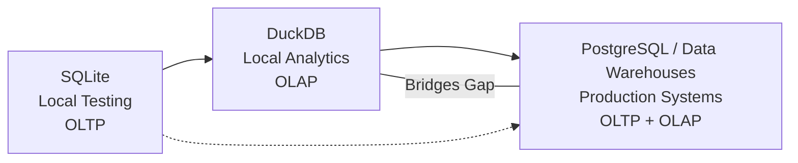

# DuckDB in Data Engineering

## Meet DuckDB: The SQL Powerhouse for Your Laptop
You may already know **SQLite** for local testing and **PostgreSQL** for production pipelines.  
Now, meet **DuckDB**—an in-process analytical database often called the *“SQLite for analytics.”*  

Unlike SQLite, DuckDB is built for **complex analytical queries on large files**, with **zero setup** and **high performance**, all while running locally.

---

## Why DuckDB Is a Big Deal

### 🚀 In-Process & Embedded
- Runs **inside your application** (no server setup, no daemons).  
- *“In-process” means the database engine executes within the same process as your application.*

### ⚡ Designed for Analytics Workloads
- Optimized for **OLAP (Online Analytical Processing)** tasks such as aggregations and joins.  
- Focuses on analytics, **not transactional inserts** like OLTP systems.

### 📊 Columnar Storage Engine
- Stores data **by columns** instead of rows.  
- Improves query performance for analytical tasks.

### 🖥️ Vectorized Execution
- Processes data in **batches (vectors)** for better CPU efficiency.  
- Enables faster execution compared to row-at-a-time processing.

### 📂 Native File Format Support
- Directly queries **Parquet** and **CSV** files.  
- No need to import into a traditional database.

---

## When to Use DuckDB

- **Exploratory Data Analysis (EDA)** on large local files.  
- **Direct querying** of Parquet/CSV without importing.  
- **Integration with Python or R** for interactive analysis in Jupyter notebooks.  
- **Running complex SQL analytics locally** without needing Postgres or BigQuery.

---

## DuckDB vs SQLite vs PostgreSQL

| Feature         | SQLite        | PostgreSQL            | DuckDB                |
|-----------------|--------------|-----------------------|-----------------------|
| Setup           | Embedded      | Requires server       | Embedded              |
| Best For        | Local app data| Production systems    | Analytical queries    |
| File Access     | Basic         | Needs import          | Native Parquet/CSV    |
| Analytics Speed | Low           | High                  | Very High             |
| Designed For    | OLTP          | OLTP + OLAP           | OLAP                  |

---

## 📊 DuckDB in the Data Engineering Ecosystem

---

## Where You’ll See DuckDB in Action

- **Notebooks** → fast, local analytics.  
- **ETL pipelines** → pre-processing files before loading into a data warehouse.  
- **Data science workflows** → working alongside Pandas or Polars.  
- **Machine learning prep** → handling datasets too large for memory, but still needing SQL wrangling.

---

## 🔑 Key Takeaway
DuckDB is a lightweight yet powerful **analytical SQL engine**.  
It bridges the gap between **local development tools (like SQLite)** and **big data warehouses (like Postgres/BigQuery)**—making it a go-to choice for **data engineers, analysts, and scientists** working with large local datasets.
