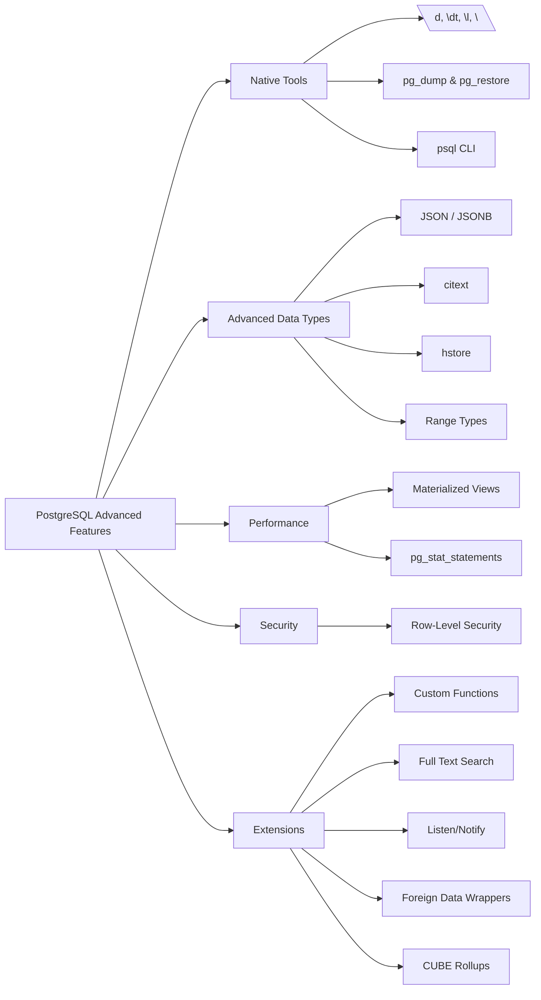

# 🚀 Going Beyond Basics: Advanced PostgreSQL Features & Extensions  

You already know how to work with tables, joins, and filters using `WHERE`. That’s a solid foundation!  

But PostgreSQL isn’t just a database—it’s a **complete data engineering toolkit**. Let’s explore some advanced features and extensions that can make your projects faster, smarter, and more powerful.  

---

## 📌 Native PostgreSQL Features  

### 🔹 Slash Commands (`\d`, `\dt`, `\l`, `\?`)  
Shortcuts in the `psql` terminal:  
- `\d users` → Show table columns  
- `\dt` → List all tables  
- `\l` → List all databases  
- `\?` → Show all commands  

---

### 🔹 `pg_dump` & `pg_restore` – Backup & Restore  
Database backup and migration tools:  

- **Plain SQL (`-F p`)** → Human-readable SQL file  
- **Custom Binary (`-F c`)** → Compressed & selective restore  
- **Directory (`-F d`)** → One file per table, supports parallel import/export  
- **Tar (`-F t`)** → Full `.tar` archive  

✅ Used for **automated backups, migrations, and disaster recovery**.  

---

### 🔹 `psql` – Command Line Interface  
- Run queries, scripts, and admin tasks.  
- Commonly used in **servers, VMs, and Docker**.  
- Fast, reliable, and scriptable.  

---

## 🛠️ Advanced Data Types  

### 🔹 JSON & JSONB  
- **JSON** → Raw text storage  
- **JSONB** → Binary, faster, indexable  

✅ Great for **logs, settings, dynamic attributes**.  

---

### 🔹 `citext` – Case-Insensitive Text  
- `"Apple" = "apple"`  

✅ Prevents duplicates in **emails, usernames, cities**.  

---

### 🔹 `hstore` – Key-Value Storage  
Example:  
```sql
"profile" => "admin", "theme" => "dark"
```
✅ For IoT metadata, user preferences, CMS configs.

---
### 🔹 Range Types
Store intervals like:
- `5–10`
- `2023-01-01 to 2023-01-31`
✅ Perfect for bookings, events, subscriptions.

---
## 📊 Performance & Optimization
### 🔹 Materialized Views
- Like views, but results stored physically.
- Can be refreshed on demand.
✅ Faster dashboards, analytics, repeated queries.

---
### 🔹 `pg_stat_statements` – Query Performance
- Logs queries, frequency, and execution time.
- Helps identify bottlenecks.

---
## 🔐 Security
### 🔹 Row-Level Security (RLS)
- Restrict access at the row level.
✅ Essential for multi-tenant systems & secure APIs.

---
## ⚡ Extending PostgreSQL
### 🔹 Custom Functions
Write logic inside DB using:
- `PL/pgSQL`
- Python (via extensions)
✅ Great for business rules, tax logic, batch updates.

### 🔹 Full Text Search (`tsvector`)
- Fast search on text fields.
✅ Used for product search, blogs, documentation.

### 🔹 Listen/Notify – Pub/Sub System
- Real-time messaging between sessions.
✅ For emails, cache updates, service syncs.

### 🔹 Foreign Data Wrappers (FDW)
- Query MySQL, CSVs, APIs as if they were Postgres tables.
✅ Useful for **ETL pipelines, legacy integration**.

### 🔹 CUBE – OLAP Rollups
- All combinations of `GROUP BY` dimensions.
✅ Simplifies **business reporting & aggregations**.

## 📖 Bonus Read
“Just Use Postgres” – Michael McCue’s Love Letter to PostgreSQL

## 🧾 PostgreSQL Advanced Features Cheat Sheet

