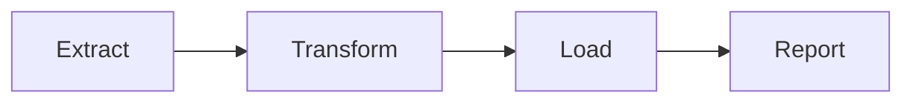

# Workflow Orchestration — A Practical Summary

## What Is Workflow Orchestration?

Workflow orchestration is the process of **coordinating, scheduling, and monitoring tasks** in a data pipeline so they run:

- In the correct order
- At the right time
- With proper dependencies and resources

In data engineering terms, it ensures that steps like **data ingestion, transformation, storage, and reporting** execute reliably and automatically.

> Think of it like a chef running a kitchen: every task happens in sequence (or parallel), and nothing moves forward if something breaks.

---

## Why Does Workflow Orchestration Matter?

As data systems scale, **manual script execution becomes unreliable**.

### Without orchestration:
- Job failures go unnoticed
- Data becomes inconsistent
- Teams accidentally overwrite or misuse data
- Engineers waste time monitoring pipelines manually

### With orchestration:
- Pipelines are **automated**
- Failures are **observable**
- Dependencies are **enforced**
- Systems become **reliable and scalable**

---

## Real-Life Use Case Example

### Ride-Sharing Company Nightly Pipeline

Every night:

1. Pull trip data from mobile apps
2. Clean and transform the data
3. Load it into a data warehouse
4. Generate driver earnings reports
5. Notify accounting

Without orchestration:
- Step 4 may run even if step 2 fails → **incorrect payouts**

With orchestration:
- Each step runs **only if the previous one succeeds**
- Failures trigger **alerts**
- Data integrity is preserved

---

## Orchestration Models

### 1. DAG-Based Orchestration (Imperative)

Used by tools like **Apache Airflow**.

- Workflows are defined as **Directed Acyclic Graphs (DAGs)**
- Each node is a task
- Edges define dependencies

Example flow:




**Strengths**
- Clear dependency visualization
- Easy failure tracing
- Industry standard

---

### 2. Asset-Based Orchestration (Declarative)

Used by **Dagster** and **Prefect**.

- Define *what data assets should exist*
- Tool figures out *when and how to run tasks*
- Tracks lineage, freshness, and quality

Example mindset:
> “This dashboard should always reflect the latest cleaned data.”

**Strengths**
- Better observability
- Strong data quality guarantees
- Cleaner mental model

---

## Popular Workflow Orchestration Tools

| Tool     | Known For |
|---------|----------|
| **Airflow** | Industry standard, highly flexible |
| **Dagster** | Asset-based, strong observability |
| **Prefect** | Python-native, developer-friendly |
| **Flyte** | ML-focused, CNCF-backed |

---

## Where Workflow Orchestration Is Used

### ETL Pipelines
- Extract → Transform → Load workflows for analytics

### Dashboard Updates
- Scheduled refreshes for BI tools like Looker or Power BI

### ML Pipelines
- Model training, evaluation, and deployment

### Alerts & Maintenance
- Slack/email alerts on failures
- Cleanup of temporary or old data

---

## A Day in an Orchestrated Pipeline

**Streaming platform example (2 AM daily job):**

1. Ingest yesterday’s view logs
2. Clean and enrich data
3. Compute watch-time metrics
4. Store in data warehouse
5. Update recommendation models
6. Send “Top Picks” emails by 8 AM

No manual intervention.  
Failures trigger alerts with logs.

---

## Example: Simple Apache Airflow DAG (Python)

```python
from airflow import DAG
from airflow.operators.python import PythonOperator
from datetime import datetime

def extract():
    print("Extracting data")

def transform():
    print("Transforming data")

def load():
    print("Loading data")

with DAG(
    dag_id="simple_etl_pipeline",
    start_date=datetime(2024, 1, 1),
    schedule_interval="@daily",
    catchup=False,
) as dag:

    extract_task = PythonOperator(
        task_id="extract",
        python_callable=extract
    )

    transform_task = PythonOperator(
        task_id="transform",
        python_callable=transform
    )

    load_task = PythonOperator(
        task_id="load",
        python_callable=load
    )

    extract_task >> transform_task >> load_task
```

### What This Does

- Runs daily
- Enforces task order
- Stops execution if a task fails
- Provides logs and monitoring
